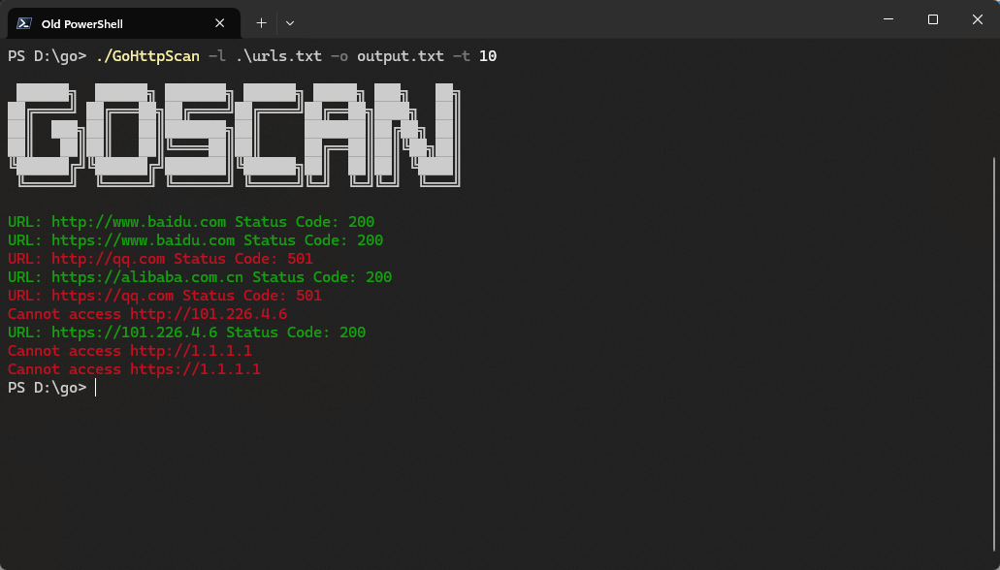

# GoHttpScan

```
Usage: GoHttpScan -l <urls.txt> -o <output.txt> [-t <threads>] [-h]
 -l : URL list file
 -o : Output file (default output.txt)
 -t : Number of threads (default 10)
 -h : Show help
```


